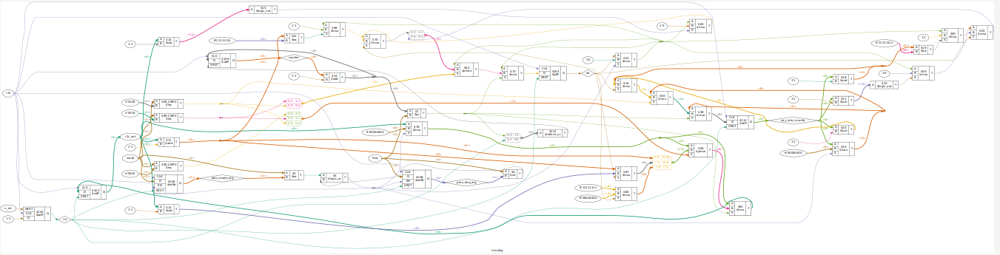
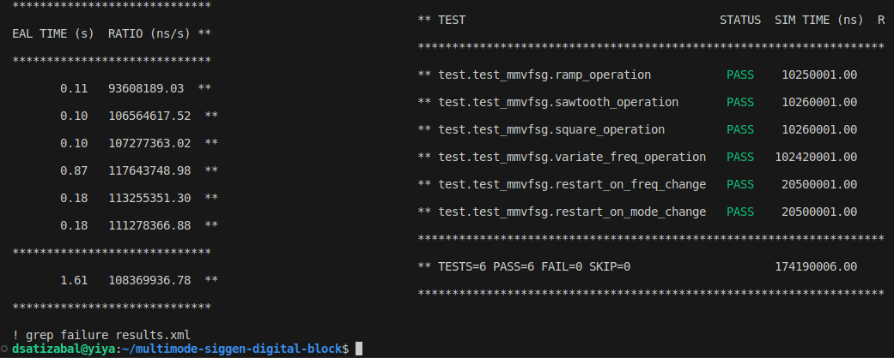
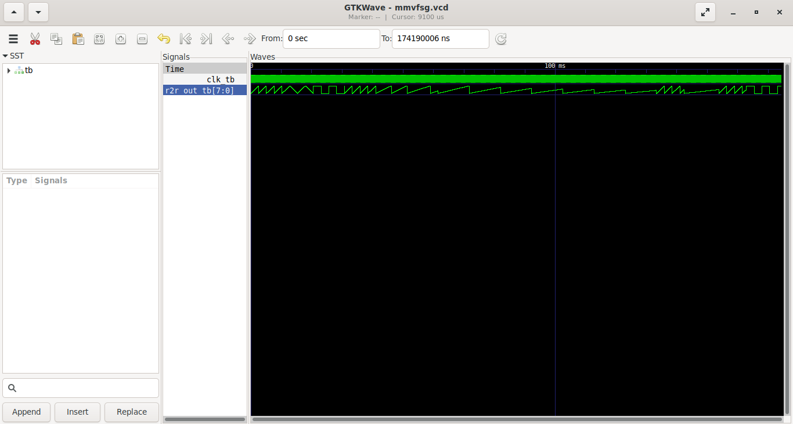

# Digital block of the Multimode Variable Frequency Signal Generator

Implements the digital block of the Multimode Variable Frequency Signal generator (MMVFSG) that is completed with an R2R DAC analog block to be sent for TapeOut with [TinyTapeout](https://tinytapeout.com/) 

## Inputs and Outputs description:

- **clk**: input of clock
- **n_rst**: reset signal (active low)
- **freq**: (4-bits) frequency divider for clock
- **mode**: (4-bits) Mode of operation (1 = Ramp, 2 = Sawtooth, 4 = Squarewave, other values are invalid)
- **r2r_out**: 8-bits output to DAC

## Operation:

If the *n_rst* signal is driven low for at least one clock cycle the operation is resetted meaning that the signal generator will set internal counter to 0 and will start generating the output signal from the beginning of the corresponding cycle according to the selected _mode_.

As indicated, the operating modes are:

- 1d = Ramp
- 2d = Sawtooth
- 4d = Square

The _freq_ value is a frequency divider, the internal clock will be divided by this value when outputting the corresponding generated values to the DAC.

## Synthetizing with YoSys:

Run:

```
make synth
```

and you should see a YoSys window opening showing the synthesis like this (kind of complex this one :S):



observe this synth does not use standard cells.

## Running CocoTB tests:

Type the following command to run tests:

```
make tests
```

you should see a result like this:



Observe in the Makefile that a dump_stack.v file is included and used to run the test command, in that file, the output file and the variables to be dumped (the name of the top module) are defined, after running the test the corresponding .vcd (value change dump) file is created and you can proceed to view it with the GtkWave command:

```
make gtkwave
```

a GtkWave window will open, you should see the hierarchy of the stack containing the available signals that can be displayed for examination, like in our case we're viewing the clk, rst, enable, operation, data_in, data_out, empty and full:



the tests use a TestBench defined in the tb.v file, this file instantiates the stack and wires the corresponding signals.

## Running Formal Verification:

WIP
